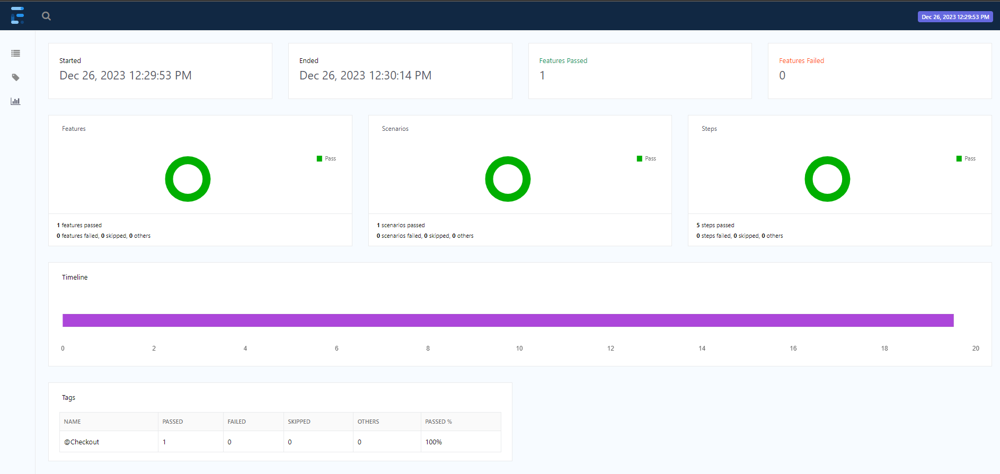

# Created By Muhammad Arsalan for  Small World Financials BDD_Web_Automation_Framework.

## Description:

This framework based on BDD Cucumber End To End Automation Framework by using Selenium WebDriver with TestNG.
Including Maven, Extent Reporting and Page Object Model design pattern(POM).

## Tech and Tools:

- Java (JDK 19) used as a Programming Language.

- Selenium 4 used for Web UI automation

- TestNG Framework: Used for Test case priority and execution of testcases

- Cucumber BDD: Used for Test Cases Mapping in plain text by using Gherkin language.

- Design Pattern: Page Object Model(POM)

- Extent Report: Used as a Reporting

- Maven: Used as a Build Management tool

- GitHub: Used as a version control

## How to execute the file and run the test??

- Clone the project from gitHub public Repository

- Open IDE IntelIj or Eclipse

- Wait for the loading the project

## Execution Method:

Method : 001 Go to runner package and execute TestRunner for execution.

Method : 002 Go to root src package and execute testNG.xml file for execution.

## TestCase Execution Report Snapshots:

